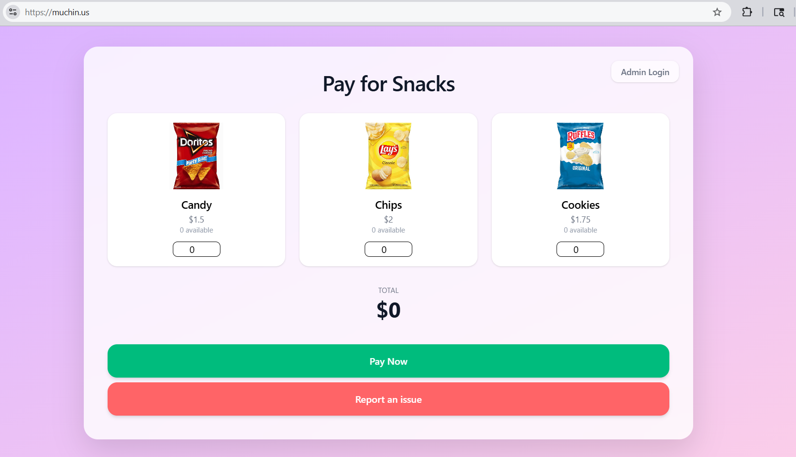
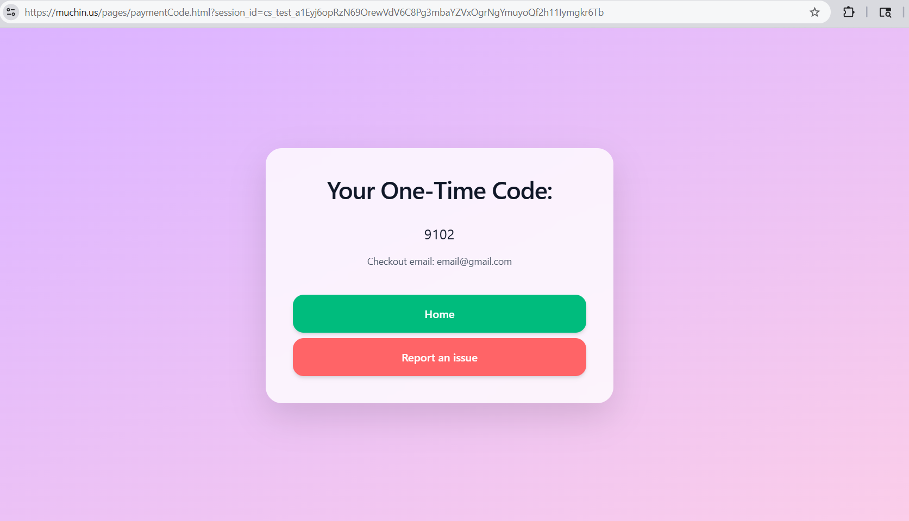
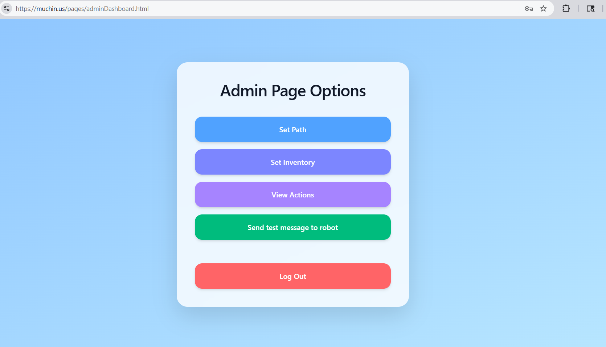

# [Vending Machine Website](https://github.com/orgs/Vendning-Machine-Team/repositories) - Website Team (Frontend)
### By Samantha Machado, Prince Patel, Adeyemi Akanbi, with advisory from Matthew Beck

__Please consider__: if you like it __star it__!

## Tech Stack
- **Languages:** HTML, Javascript
- **Cloud:** AWS EC2 *(running NGINX)*
- **Toolkits:** Vite, Tailwindcss, Stripe *(payment processing)*
- **Database:** SQLite *(authentication, product details, and session codes/ID's)*

## Roles

  

**Samantha Machado ([LinkedIn](https://www.linkedin.com/in/samantha-machado-b7b5a7329/) | [GitHub](https://github.com/SamMac55))**
* Software Architect *(architected website structure)*
* Software Engineer *(utilized Tailwind to stylize the website, Added communication between frontend and backend via API requests, Collaborated to create an administrative dashboard system, Collaborated to develop website structure)*

  

**Prince Patel ([LinkedIn](https://www.linkedin.com/in/ppatel9114/) | [GitHub](https://github.com/IMPr1nce))**
* Software Engineer *(added payment processing with stripe integration, Implemented intuitive Interface to streamline user experience, Collaborated to create an administrative dashboard system, Collaborated to develop website structure)*

**Adeyemi Akanbi ([LinkedIn](https://www.linkedin.com/in/adeyemi-akanbi-62a1a1386/) | [GitHub](https://github.com/AdeyemiAkanbi))**
* Software Engineer *(collaborated to create an administrative dashboard system and Collaborated to develop website structure)*

  

**Matthew Beck ([LinkedIn](https://www.linkedin.com/in/matthewthomasbeck/) | [GitHub](https://github.com/matthewthomasbeck) | [Website](https://www.matthewthomasbeck.com)):**
* Architecture Consultant *(collaborated with Samantha to design website architecture, provided basic frontend-to-backend implementation)*

## Overview
This website presents a playful yet highly functional digital storefront for purchasing snacks that are dispensed through a physical, [mobile robot](https://github.com/Vendning-Machine-Team/Vending_Machine_Robot-Hardware). Its visual design leans heavily into a colorful pastel aesthetic, with a soft pink background that immediately creates a welcoming and cheerful atmosphere. The layout is intentionally clean and intuitive, allowing users to browse available snacks, make selections, and complete purchases without confusion. Every element of the interface is designed with accessibility and simplicity in mind, ensuring that even first-time users can navigate the experience smoothly.

Once a purchase is completed, the website generates a unique, one-time-use code tied directly to the transaction. This code acts as the bridge between the digital and physical experience: the code is sent to the robot via the [backend](https://github.com/Vendning-Machine-Team/Vending_Machine_Website-Backend), while customers also input the same code into the robot to securely retrieve their purchase. The process is streamlined to minimize friction, reinforcing the site’s focus on ease of use and quick interaction. The system ensures that each code is valid for a single redemption, maintaining both efficiency and security in the handoff from online purchase to real-world fulfillment.

Behind the scenes, the website includes a dedicated administrative login that enables authorized users to manage key operational aspects. Through this admin interface, administrators can monitor and update the robot’s inventory, ensuring that stock levels accurately reflect what is physically available. They can also adjust the pricing of individual snacks as needed, providing flexibility in response to supply or demand. These controls are clearly separated from the customer-facing experience, allowing the platform to function as both a user-friendly storefront and a practical management tool for maintaining the robot’s operations.

